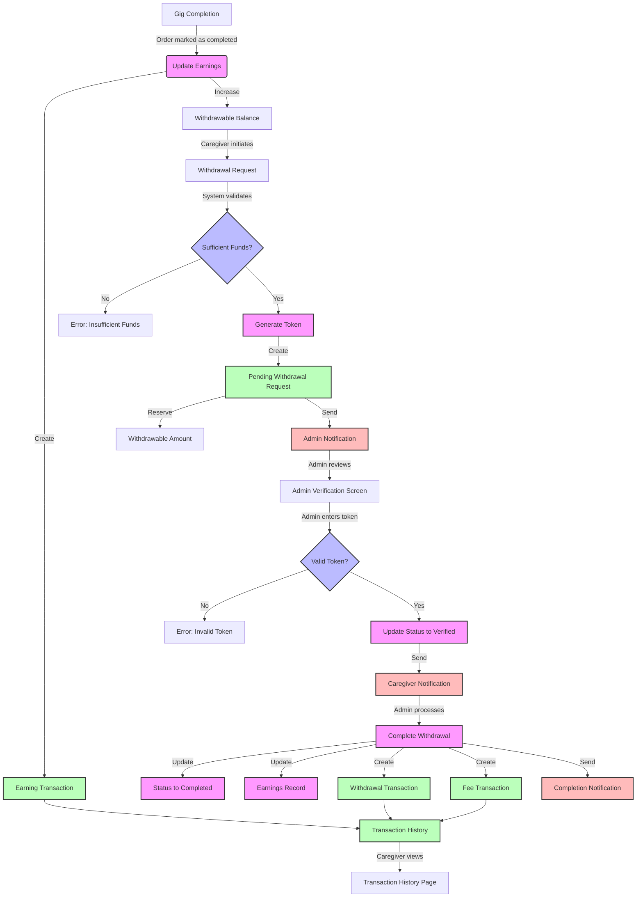
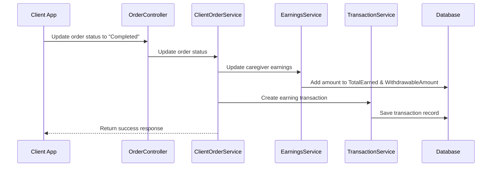
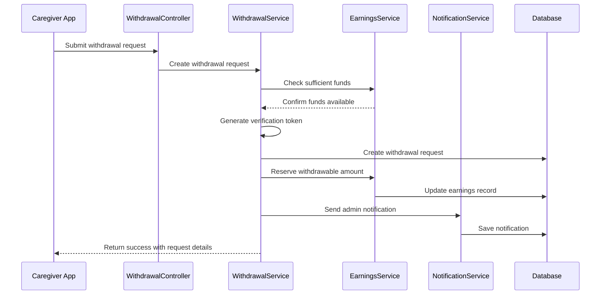
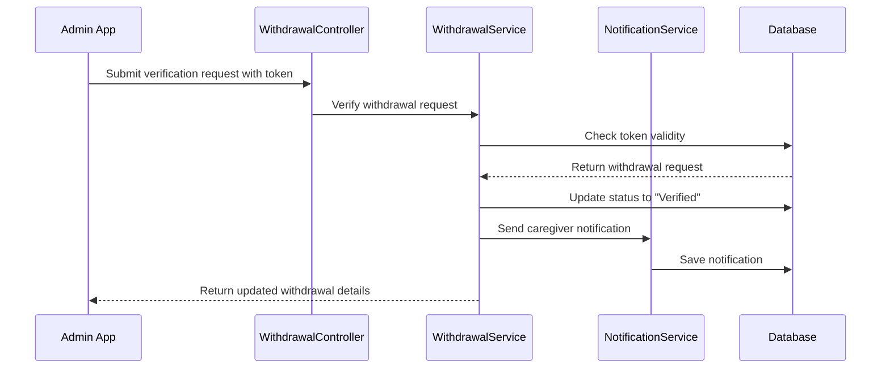
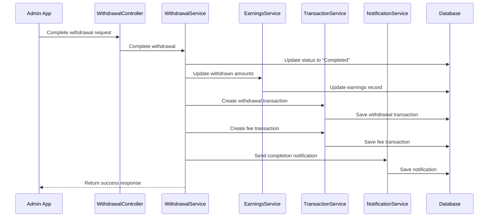
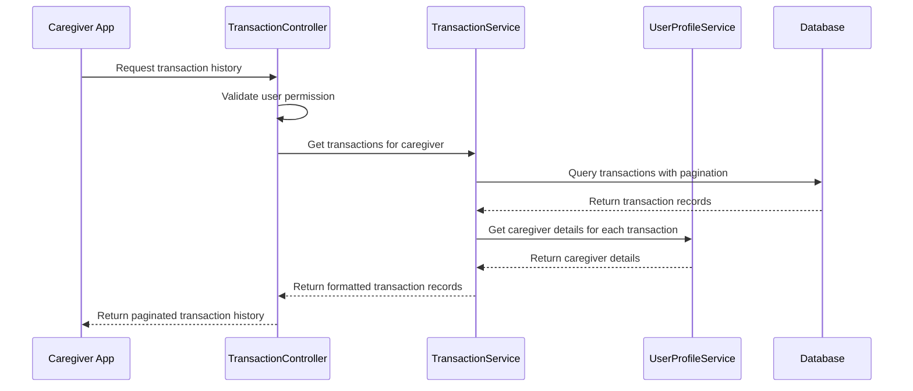

# 🏦 Caregiver Withdrawal System Flow

## 🔄 Complete System Flow



## 💰 1. Earnings Accumulation

### Frontend:
📊 **Dashboard View**

```
┌────────────────────────────────────────────┐
│                                            │
│  EARNINGS DASHBOARD                        │
│                                            │
│  ┌──────────────┐  ┌──────────────┐        │
│  │              │  │              │        │
│  │  ₦50,000     │  │  ₦45,000     │        │
│  │  Total       │  │  Available   │        │
│  │  Earned      │  │  Balance     │        │
│  │              │  │              │        │
│  └──────────────┘  └──────────────┘        │
│                                            │
│  ┌──────────────┐  ┌──────────────┐        │
│  │              │  │              │        │
│  │  ₦5,000      │  │  WITHDRAW    │        │
│  │  Withdrawn   │  │  FUNDS       │        │
│  │              │  │              │        │
│  └──────────────┘  └──────────────┘        │
│                                            │
└────────────────────────────────────────────┘
```

### Backend Flow:



## 💸 2. Withdrawal Request Initiation

### Frontend:
📝 **Withdrawal Modal**

```
┌─────────────────────────────────────────────────┐
│                                                 │
│  REQUEST WITHDRAWAL                   [X]       │
│  ────────────────────────────────────────       │
│                                                 │
│  Amount to Withdraw (₦)                         │
│  ┌─────────────────────────────────────┐        │
│  │ 10000                               │        │
│  └─────────────────────────────────────┘        │
│  Available: ₦45,000                             │
│                                                 │
│  ┌─────────────────────────────────────┐        │
│  │ Amount Requested:     ₦10,000       │        │
│  │ Service Charge (10%): ₦1,000        │        │
│  │ Final Amount:         ₦9,000        │        │
│  └─────────────────────────────────────┘        │
│                                                 │
│  Bank Name                                      │
│  ┌─────────────────────────────────────┐        │
│  │ First Bank                          │        │
│  └─────────────────────────────────────┘        │
│                                                 │
│  Account Number                                 │
│  ┌─────────────────────────────────────┐        │
│  │ 1234567890                          │        │
│  └─────────────────────────────────────┘        │
│                                                 │
│  Account Name                                   │
│  ┌─────────────────────────────────────┐        │
│  │ John Doe                            │        │
│  └─────────────────────────────────────┘        │
│                                                 │
│  ┌───────────┐            ┌───────────────┐     │
│  │ CANCEL    │            │ SUBMIT        │     │
│  └───────────┘            └───────────────┘     │
│                                                 │
└─────────────────────────────────────────────────┘
```

### Backend Flow:



## 🔐 3. Admin Verification Process

### Frontend:
🔍 **Admin Withdrawal Management Dashboard**

```
┌────────────────────────────────────────────────────────────────────────────────────┐
│                                                                                    │
│  WITHDRAWAL MANAGEMENT                                                             │
│                                                                                    │
│  Filter by status: [All Requests ▼]                                                │
│                                                                                    │
│  ┌──────────────────────────────────────────────────────────────────────────────┐  │
│  │                                                                              │  │
│  │  Date        Caregiver     Amount    Fee      Final     Status    Action     │  │
│  │  ────────────────────────────────────────────────────────────────────────    │  │
│  │                                                                              │  │
│  │  2025-06-17  John Doe      ₦10,000   ₦1,000   ₦9,000   PENDING   [VERIFY]   │  │
│  │                                                                              │  │
│  │  2025-06-16  Jane Smith    ₦25,000   ₦2,500   ₦22,500  VERIFIED  [COMPLETE] │  │
│  │                                                                              │  │
│  │  2025-06-15  Mike Johnson  ₦5,000    ₦500     ₦4,500   COMPLETED  Processed │  │
│  │                                                                              │  │
│  └──────────────────────────────────────────────────────────────────────────────┘  │
│                                                                                    │
└────────────────────────────────────────────────────────────────────────────────────┘
```

📋 **Token Verification Modal**

```
┌─────────────────────────────────────────────────┐
│                                                 │
│  VERIFY WITHDRAWAL REQUEST            [X]       │
│  ────────────────────────────────────────       │
│                                                 │
│  Caregiver: John Doe                            │
│  Amount: ₦10,000                                │
│  Fee: ₦1,000                                    │
│  Final Amount: ₦9,000                           │
│                                                 │
│  Enter Verification Token                       │
│  ┌─────────────────────────────────────┐        │
│  │ XYZ12345                            │        │
│  └─────────────────────────────────────┘        │
│                                                 │
│  Admin Notes (Optional)                         │
│  ┌─────────────────────────────────────┐        │
│  │ Payment processed via bank transfer  │        │
│  └─────────────────────────────────────┘        │
│                                                 │
│  ┌───────────┐            ┌───────────────┐     │
│  │ CANCEL    │            │ VERIFY        │     │
│  └───────────┘            └───────────────┘     │
│                                                 │
└─────────────────────────────────────────────────┘
```

### Backend Flow:



## 🔄 4. Withdrawal Completion

### Backend Flow:



## 📊 5. Transaction History View

### Frontend:
📜 **Transaction History View**

```
┌────────────────────────────────────────────────────────────────────────────┐
│                                                                            │
│  TRANSACTION HISTORY                                                       │
│                                                                            │
│  ┌────────────────────────────────────────────────────────────────────┐    │
│  │                                                                    │    │
│  │  Date        Type        Description               Amount   Ref    │    │
│  │  ────────────────────────────────────────────────────────────────  │    │
│  │                                                                    │    │
│  │  2025-06-18  EARNING     Payment for completed     +₦15,000  #1245 │    │
│  │                          gig: Home Care                            │    │
│  │                                                                    │    │
│  │  2025-06-17  WITHDRAWAL  Withdrawal to bank        -₦9,000   #W387 │    │
│  │                          account                                   │    │
│  │                                                                    │    │
│  │  2025-06-17  FEE         Service fee for          -₦1,000   #W387 │    │
│  │                          withdrawal (10%)                          │    │
│  │                                                                    │    │
│  │  2025-06-15  EARNING     Payment for completed     +₦20,000  #1242 │    │
│  │                          gig: Elder Care                           │    │
│  │                                                                    │    │
│  └────────────────────────────────────────────────────────────────────┘    │
│                                                                            │
│  ◄ Previous   Page 1 of 2   Next ►                                         │
│                                                                            │
└────────────────────────────────────────────────────────────────────────────┘
```

### Backend Flow:



## 📱 Data Model Diagrams

### Entities Relationship Diagram

```mermaid
erDiagram
    Caregiver ||--o{ Earnings : has
    Caregiver ||--o{ WithdrawalRequest : makes
    Caregiver ||--o{ TransactionHistory : has
    Gig ||--o{ ClientOrder : fulfills
    ClientOrder ||--o{ TransactionHistory : generates
    WithdrawalRequest ||--o{ TransactionHistory : generates
    
    Caregiver {
        string Id
        string FirstName
        string LastName
        string Email
    }
    
    Earnings {
        string Id
        string CaregiverId
        decimal TotalEarned
        decimal WithdrawableAmount
        decimal WithdrawnAmount
        datetime CreatedAt
        datetime UpdatedAt
    }
    
    WithdrawalRequest {
        string Id
        string CaregiverId
        decimal AmountRequested
        decimal ServiceCharge
        decimal FinalAmount
        string Token
        string Status
        datetime CreatedAt
        datetime VerifiedAt
        datetime CompletedAt
        string AdminNotes
        string AccountNumber
        string BankName
    }
    
    TransactionHistory {
        string Id
        string CaregiverId
        string TransactionType
        decimal Amount
        string Description
        string ReferenceId
        datetime CreatedAt
    }
